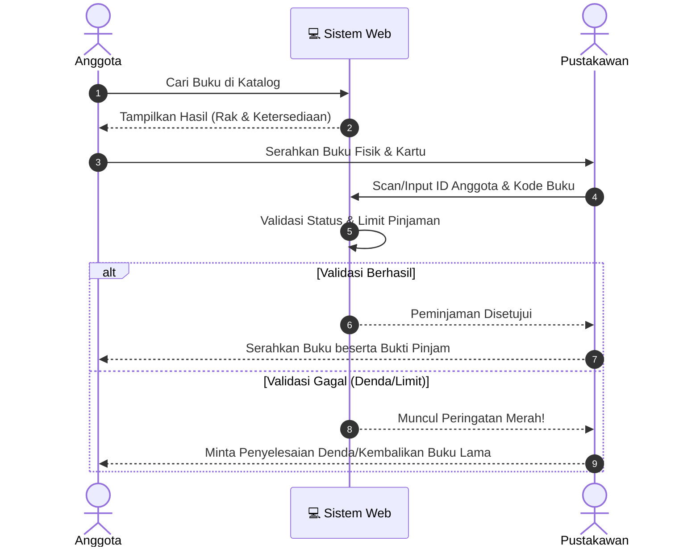

<div align="center">
  

  # 📚 Sistem Informasi Perpustakaan Desa Bulaksari

  *Membangun Literasi, Memajukan Desa.*

  []()
  []()
  []()
</div>

---

## 📖 Tentang Proyek

Sistem Informasi **Perpustakaan Desa Bulaksari** adalah platform digital berbasis web yang dirancang khusus untuk mempermudah tata kelola perpustakaan di tingkat desa. Dengan antarmuka yang ramah pengguna, sistem ini membantu pustakawan dalam mendata buku, mengelola anggota, serta melacak transaksi sirkulasi (peminjaman dan pengembalian) secara efisien dan transparan.

---

## ✨ Fitur Unggulan

- 📊 **Dasbor Interaktif**: Ringkasan real-time jumlah buku, anggota aktif, dan grafik peminjaman bulanan.
- 📚 **Katalog Pintar**: Pencarian buku tingkat lanjut berdasarkan judul, pengarang, kategori, atau ISBN.
- 👥 **Manajemen Keanggotaan**: Pendaftaran warga desa sebagai anggota, lengkap dengan fitur cetak kartu perpustakaan otomatis.
- 🔄 **Sistem Sirkulasi**: Alur peminjaman dan pengembalian yang mudah dengan notifikasi denda jika terjadi keterlambatan.
- 📱 **Desain Responsif**: Tampilan yang rapi dan nyaman digunakan melalui Komputer, Tablet, maupun Smartphone.

---

## 📈 Alur Sistem (Grafik Interaktif)

*(Grafik di bawah ini menggunakan Mermaid.js yang akan otomatis ter-render menjadi diagram interaktif di GitHub)*



---

## 🛠️ Teknologi yang Digunakan

| Komponen | Teknologi / Framework |
| :--- | :--- |
| **Frontend & API** |    |
| **Database & Auth** |   |
| **Deployment** |  |

---

## 🚀 Panduan Instalasi (Local Development)

Berikut adalah panduan langkah demi langkah untuk menjalankan sistem ini di komputer Anda:

<details>
  <summary><b>🛠️ Klik di sini untuk melihat langkah instalasi</b></summary>
  
  <br>

  1. **Clone Repositori:**
     ```bash
     git clone https://github.com/USERNAME_KAMU/perpustakaan-desa-bulaksari.git
     ```
  2. **Masuk ke Direktori Proyek:**
     ```bash
     cd perpustakaan-desa-bulaksari
     ```
  3. **Instal Dependensi:**
     ```bash
     npm install
     ```
  4. **Konfigurasi Environment (Jika sudah terhubung Supabase):**
     - Buat file `.env.local`
     - Tambahkan API keys dari dashboard Supabase Anda:
       ```env
       NEXT_PUBLIC_SUPABASE_URL=https://your-project.supabase.co
       NEXT_PUBLIC_SUPABASE_ANON_KEY=your-anon-key
       ```
  5. **Mulai Server Lokal:**
     ```bash
     npm run dev
     ```
     Buka web browser dan akses: `http://localhost:3000`

</details>

---

## 📸 Cuplikan Layar (Screenshots)

Berikut adalah antarmuka sistem kami:

| Halaman Dasbor | Halaman Katalog Buku |
|:---:|:---:|
|  |  |

*(Catatan: Ganti URL gambar placeholder di atas dengan path gambar asli aplikasi Anda yang ada di folder `docs` atau `assets/img`)*

---

## 🤝 Cara Berkontribusi

Kami sangat menyambut baik kontribusi Anda untuk mengembangkan perpustakaan desa ini! 
- **Bug Reports:** Gunakan fitur *Issues* untuk melaporkan bug.
- **Pull Requests:** 
  1. *Fork* proyek ini.
  2. Buat *branch* fitur Anda (`git checkout -b fitur/NamaFitur-Baru`).
  3. Lakukan *commit* (`git commit -m 'Menambahkan fitur X'`).
  4. *Push* ke *branch* (`git push origin fitur/NamaFitur-Baru`).
  5. Buka *Pull Request*.

---

## 📄 Lisensi

Proyek ini menggunakan Lisensi **MIT**. Anda bebas untuk menggunakan, menyalin, dan memodifikasi proyek ini. Lihat file [LICENSE](./LICENSE) untuk detail lebih lanjut.

---

<div align="center">
  <sub>Dibuat dengan ❤️ untuk kemajuan literasi <b>Desa Bulaksari</b></sub>
</div>
